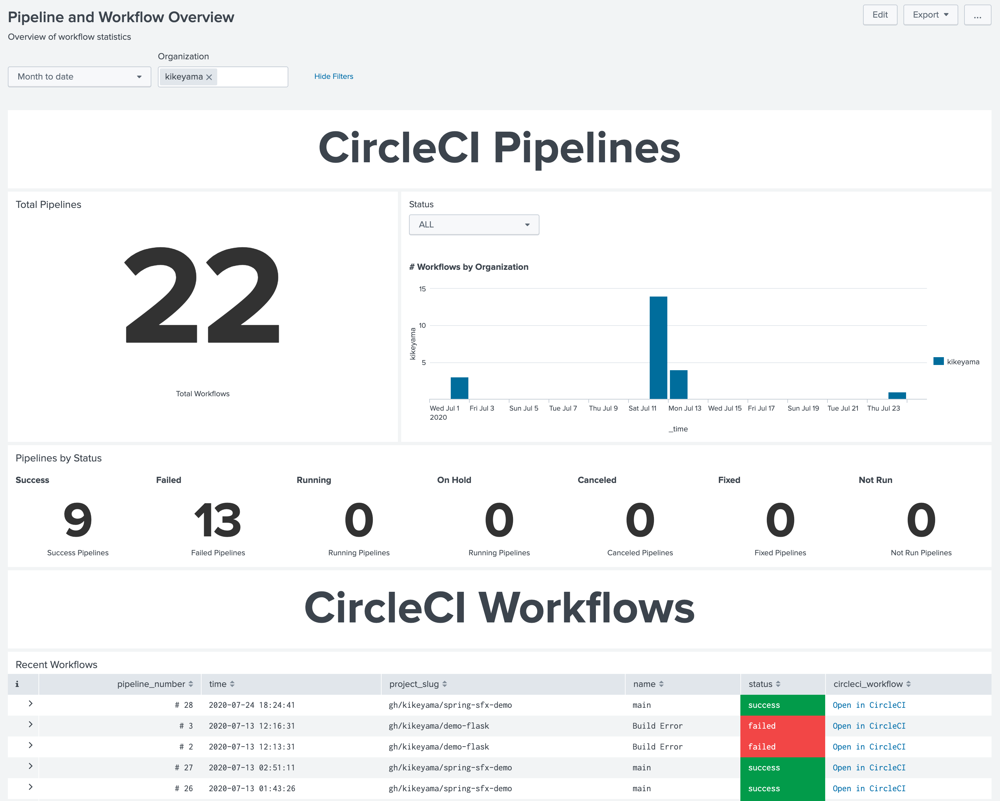
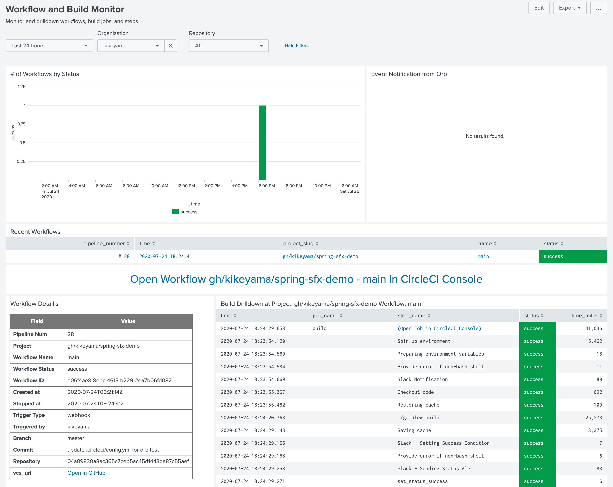

# Splunk App for CircleCI

Collect and visualize workflows, jobs, and steps data from CircleCI cloud  

## Dashboards

### CircleCI Overview

  
  
- Number of triggered pipelines by status
- Recent workflows and drilldown to jobs
- Open CircleCI console from workflows table
- Workflows by project and timechart

### CircleCI Insights

Visualizing statistics and analytics for past 30 days.

- Status statistics by project
- Pipeline trigger types
- Triggered users
- Failure analysis and MTTR
- Build performance statistics

### CircleCI Monitor

  
  
- Workflow monitor
- Event notification from [orb](https://circleci.com/orbs/registry/orb/kikeyama/splunk)
- Workflow details and drilldown to jobs and steps
- Open CircleCI console (workflow and job)

## Alerts

There are some built-in alert templates. Update notification like email, slack, etc.

Name | Description | Default Interval | Default Actions
-----|-------------|------------------|----------------
**CircleCI Failed Job Alert** | Searches `failed` status from CircleCI jobs for past 15 min | 10 min | Indexes as log event at `main` index
**CircleCI Modular Input Error** | Searches `ERROR` log_level from _internal logs for past 15 min | 10 min | Indexes as log event at `main` index

## Data

Source Types | Description | Data source
-------------|-------------|------------
`circleci:workflow` | Default sourcetype of CircleCI workflows | Modular Input
`circleci:job` | Default sourcetype of CircleCI jobs | Modular Input
`circleci:step` | Default sourcetype of CircleCI steps | Modular Input
`circleci:workflow:event` | Default sourcetype of CircleCI workflow [orb](https://circleci.com/orbs/registry/orb/kikeyama/splunk) | HTTP Event Collector
`circleci:build:event` | Default sourcetype of CircleCI job [orb](https://circleci.com/orbs/registry/orb/kikeyama/splunk) | HTTP Event Collector

## How to setup

### 1. Install this app into your Splunk

#### Splunk single instance

1. Clone or download this repository at `$SPLUNK_HOME/etc/apps` (`$SPLUNK_HOME` is the directory where you installed Splunk)
2. Rename the repo directory to `circleci`
3. Restart Splunk

#### Splunk distributed

1. Install and setup Heavy Forwarder in any host (EC2 instance, your baremetal server, or VM, etc)
2. Clone or download then rename the directory this repo at Search Heads, Indexers, and Heavy Forwarder
3. Restart each Splunk instance

#### Splunk cluster

1. Install and setup Heavy Forwarder in any host (EC2 instance, your baremetal server, or VM, etc)
2. Clone or download then rename the directory this repo at Cluster Master, Deployer, and Heavy Forwarder (or Deployment Server)

See [App deployment overview - Splunk Documentation](https://docs.splunk.com/Documentation/Splunk/latest/Admin/Deployappsandadd-ons) for more details.

#### Splunk Cloud

WIP

### 2. Get your API Token at CircleCI

1. Access your CircleCI [user settings](https://app.circleci.com/settings/user/tokens) and `Create New Token`
2. Copy your API token

### 3. Create Data Inputs at Splunk

1. `Settings` > `Data Inputs` then click `CircleCI Builds`
2. Click `New` and input settings as following 

Field | Description | Default
------|-------------|--------
`name` | Input name you prefer (can be different from CircleCI API token name) | N/A
`API Token` | API Token you copied at the previous step | N/A
`Your VCS` | Version Control System (input `github` or `bitbucket`) | N/A
`Organization name` | Organization name (example: `splunk` in `https://github.com/splunk/splunk-sdk-python`) | N/A

__Optional Settings__

Click `More settings` and display optional settings.

Field | Description | Default
------|-------------|--------
`Interval` | Interval (seconds) this app collects CircleCI data | `600`
`Source type` | Source type is defined in modular input. Can not overwrite. | `Automatic`
`Host` | Host is defined in modular input. Can not overwrite. | SPLUNK HOST
`Index` | Set index name where CircleCI workflows, jobs, and steps data. | `default`


### 4. Update Search Macro

1. `Settings` > `Advanced search` then click `Search macros`
2. Click `circleci_orb_index` and change index name (default: `main`)

## Troubleshooting

### Checkpoint endpoint

To reduce overhead of API request and event writing, modular input uses KV Store to record checkpoint.  

**Workflow checkpoint:** `/servicesNS/nobody/system/storage/collections/data/_circleci_workflow_checkpoint_collection`  
**Job Checkpoint:** `/servicesNS/nobody/system/storage/collections/data/_circleci_job_checkpoint_collection`  
See [Splunk API Doc](https://docs.splunk.com/Documentation/Splunk/8.0.5/RESTREF/RESTkvstore)

If you'd like to re-index data, delete all checkpoint above.  

```
# Delete workflow checkpoints
curl -X DELETE -u <user>:<password> -k https://<splunk_hostname>:8089/servicesNS/nobody/system/storage/collections/data/_circleci_workflow_checkpoint_collection

# Delete job checkpoints
curl -X DELETE -u <user>:<password> -k https://<splunk_hostname>:8089/servicesNS/nobody/system/storage/collections/data/_circleci_job_checkpoint_collection
```

## Open issues

If you find issues or feature request, feel free to open [issues](https://github.com/kikeyama/splunk-circleci-app/issues).
